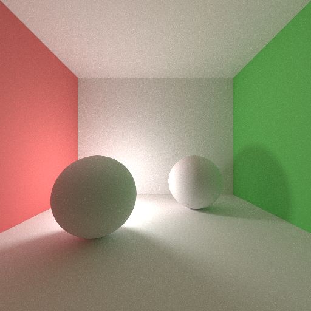
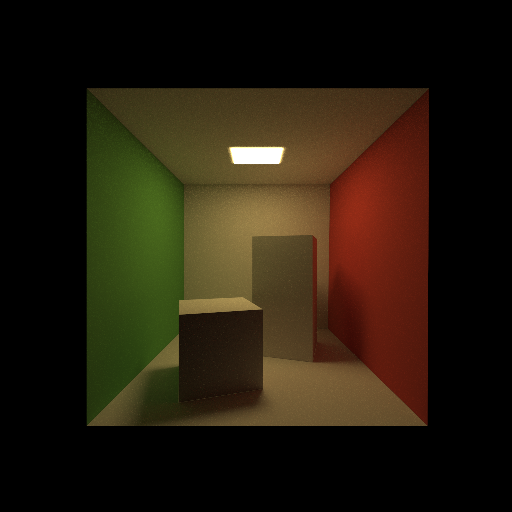
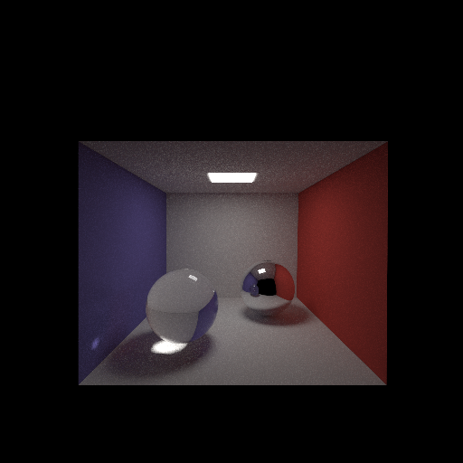

# Photorealism
Physically Based Path Tracer

* Direct Illumination
* Path Tracing
* Explicit Light Sampling
* BRDF Importance Sampling
* IBL Importance Sampling
* Multi Importance Sampling(MIS)
* Bounding Volume Hierarchy(BVH)
* Image Texture

## Usage
### Build
```bash
make build
```

### Run
```bash
./a.out -i scene_file
```

## Scene File
***.toml is scene description file.

## Example



